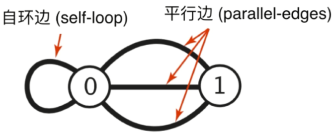
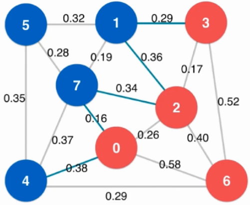
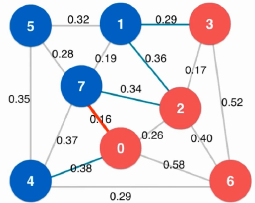

# 算法与数据结构

| 章节 | 复杂度 | 备注 |
| :--- | :--- | :--- |
| **一、[排序基础](src/main/java/sort/basic)** | | |
| 1-1 [选择排序 - Selection Sort](src/main/java/sort/basic/SelectionSort.java) | O(n^2) | 每轮选出最小的元素 |
| 1-2 [插入排序 - Insertion Sort](src/main/java/sort/basic/InsertionSort.java) | O(n^2) | 无序部分元素逐个插入有序部分 对于近似有序的序列，排序效率高 |
| **二、[高级排序](src/main/java/sort/advance)** | | |
| 2-1 [归并排序 - Merge Sort](src/main/java/sort/advance/MergeSort.java) | O(nlogn) | 递归写法 |
| 2-2 [自底向上的归并排序算法](src/main/java/sort/advance/MergeSortBU.java) | O(nlogn) | 滑块写法 |
| 2-3 [快速排序 - Quick Sort](src/main/java/sort/advance/QuickSort.java) | O(nlogn) | 递归进行选标的，分左右 |
| 2-4 [双路快速排序法](src/main/java/sort/advance/QuickSort2.java) | O(nlogn) | 优化：与标的相等的元素划分到两边 |
| 2-5 [三路快速排序法](src/main/java/sort/advance/QuickSort3.java) | O(nlogn) | 优化：划分三块，与标的相等的元素分在中间，下此不再递归处理 |
| **三、[堆和堆排序](src/main/java/heap)** | | |
| 3-1 [堆的简单实现](src/main/java/heap/MaxHeap.java) | 添加,移除: O(logn) | 最大二叉堆，固定容量 |
| 3-2 [基础堆排序](src/main/java/heap/HeapSort2.java) | O(nlogn) | 1.逐个添加，逐个取出 2.使用heapify构建对，再逐个取出 |
| 3-3 [优化堆排序 - Heap Sort](src/main/java/heap/HeapSort.java) | O(nlogn) | 不使用而外堆，直接在原数组上进行堆排序 注意两个shiftDown的区别 |
| 3-4 [索引堆](src/main/java/heap/IndexMaxHeap.java) |  | 维护原始索引 |
| 3-5 [索引堆优化](src/main/java/heap/IndexMaxHeap2.java) |  | 维护反查索引 |
| **四、[二分搜索树](src/main/java/binarysearchtree)** | | |
| 4-1 [二分查找](src/main/java/binarysearchtree/BinarySearch.java) | O(log2n) | 二分查找循环写法和递归写法 |
| 4-2 [二分搜索树](src/main/java/binarysearchtree/BinarySearchTree.java) |  | 二分搜索树的简单实现 |
| **五、[并查集](src/main/java/unionfind)** | | |
| 5-1 [并查集 - 数组实现](src/main/java/unionfind/UnionFind1.java) | 并: O(n), 查: O(1) | 数组实现的并查集 |
| 5-2 [并查集 - 节点](src/main/java/unionfind/UnionFind2.java) | 并: O(h), 查: O(h) | 使用子节点指向父节点方式实现并查集 |
| 5-3 [并查集 - size优化](src/main/java/unionfind/UnionFind3.java) | 并: O(h), 查: O(h) | 并操作将根据size决定归并方向 |
| 5-4 [并查集 - rank优化](src/main/java/unionfind/UnionFind4.java) | 并: O(h), 查: O(h) | 并操作将根据rank决定归并方向 |
| 5-5 [并查集 - 路径压缩优化(循环)](src/main/java/unionfind/UnionFind5.java) | 并: O(h), 查: O(h) | 查找操作时附带压缩路径，循环 |
| 5-6 [并查集 - 路径压缩优化(递归)](src/main/java/unionfind/UnionFind6.java) | 并: O(h), 查: O(h) | 查找操作时附带压缩路径，递归 |
| **六、[图论基础](src/main/java/graph/basic)** | | |
| 6-1 [稀疏图 - 邻接表](src/main/java/graph/basic/SparseGraph.java) | 深度优先遍历: O(V+E) | 邻接表实现稀疏图 |
| 6-2 [稠密图 - 邻接矩阵](src/main/java/graph/basic/DenseGraph.java) | 深度优先遍历: O(V^2) | 邻接矩阵实现稠密图 |
| 6-3 [求图的连通分量](src/main/java/graph/basic/Components.java) |  | 使用深度优先遍历方式求图的连通分量 |
| 6-4 [求某顶点的连通路径](src/main/java/graph/basic/Path.java) |  | 使用深度优先遍历方式求图中某一顶点到其他顶点的路径 |
| 6-5 [求最短路径](src/main/java/graph/basic/ShortestPath.java) |  | 使用广度度优先遍历方式求图中某一顶点到其他顶点的最短路径 |
| **七、[最小生成树](src/main/java/graph/minspantree)** | | |
| 7-1 [稠密带权图 - 邻接矩阵](src/main/java/graph/minspantree/DenseWeightedGraph.java) |  | 邻接矩阵实现稠密带权图 |
| 7-2 [稀疏带权图 - 邻接表](src/main/java/graph/minspantree/SparseWeightedGraph.java) |  | 邻接表实现稀疏带权图 |
| 7-3 [Lazy Prim 求最小生成树](src/main/java/graph/minspantree/LazyPrimMST.java) | O(ElogE) | 借助最小堆，逐个访问节点，将临边加入最小堆，然后取出最小的横切边， 再访问将横切边中未访问的顶点 |
| 7-4 [优化 Prim 求最小生成树](src/main/java/graph/minspantree/PrimMST.java) | O(ElogV) | 借助最小索引堆，逐个访问节点，将临边中权重最小者的权重和另一顶点存入索引堆，并记录边， 然后取出最小的索引，取出记录的边，再继续访问这个边的另一顶点 |

## 六、图论基础

### 6.1 图的分类和性质

**1. 有向性**

- 无向图：边不区分指向
- 有向图：边由一个顶点指向另一个顶点

**2. 权重**

- 无权图：图的边没有权重
- 有权图：图的边带权重

**3. 图的连通性**

- 完全连通：图中所有顶点都互相可达（下图不完全连通）
- 连通分量：连通分量表示图中有几组互相连通的顶点。以下图为例，该图的连通分量为 3。

**4. 图的边**

- 自环边：顶点自己连通自己的边
- 平行边：两个顶点中连通的多个边

### 6.2 图的表示

**1. 邻接矩阵**

- 邻接矩阵表示无向图

- 邻接矩阵表示有效图

**2. 邻接表**

- 邻接表表示无向图

- 邻接表表示有向图

> - 邻接表适合表示稀疏图（Sparse Graph）
> - 邻接矩阵适合表示稠密图（Dense Graph）

## 七、最小生成树

### 7.1 最小生成树问题

对于一个由 n 个节点的完全连通的带权无向图，选出其中 n-1 条边，这 n-1 条边连通了所有节点，并且这些边的权重和最小，这就是最小生成树，如上图所示。

最小生成树应用：电缆布线、电路设计、网络设计

### 7.2 最小生成树算法

这里需要介绍切分定理，在此之前先介绍几个概念：

**切分（Cut）**：把图中的顶点分为两部分，成为一个*切分。*

**横切边（Cross Edge）**：如果一条边的两个顶点，属于*切分*不同的两边，这个边成为*横切边*。

**切分定理**：给定任意*切分*，*横切边*中权值最小的边必然属于最小生成树。

有了切分定理，就可以求出最小生成树了。