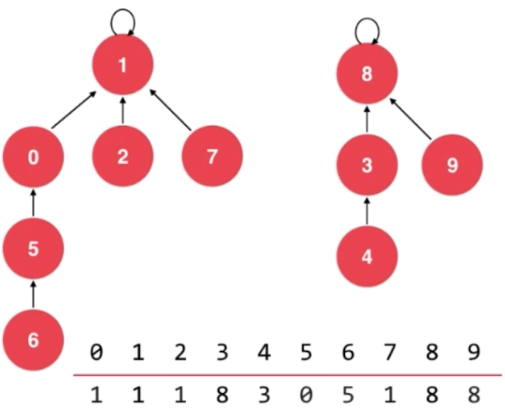
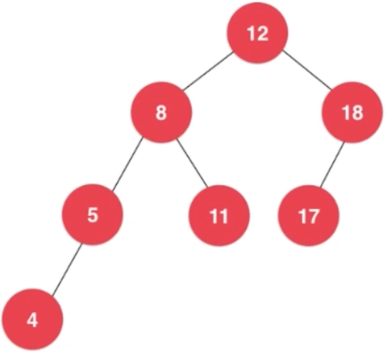

# 玩转数据结构

| 章节 | 说明 | 代码 |
| :--- | :--- | :--- |
| **一、数组** | | |
| 1-1 自定义数组 | 动态泛型数组 | [Array](src/main/java/array/Array.java) |
| **二、栈和队列** | | |
| 2-1 数组栈 | 基于数组的栈实现 | [ArrayStack](src/main/java/stack/ArrayStack.java) |
| 2-2 有效的括号 | [LeetCode(20)](https://leetcode-cn.com/problems/valid-parentheses/) | [Solution](src/main/java/stack/leetcode/Solution.java) |
| 2-3 数组队列 | 基于数组的队列实现 | [ArrayQueue](src/main/java/queue/ArrayQueue.java) |
| 2-4 循环队列 | 基于数组的循环队列实现 | [LoopQueue](src/main/java/queue/LoopQueue.java) |
| **三、最基础的动态数据结构：链表** | | |
| 3-1 链表 | 链表的基本实现 | [LinkedList](src/main/java/linkedlist/LinkedList.java) |
| 3-2 链表栈 | 使用链表实现栈 | [LinkedListStack](src/main/java/stack/LinkedListStack.java) |
| 3-3 链表队列 | 带有尾指针的链表：使用链表实现队列 | [LinkedListQueue](src/main/java/queue/LinkedListQueue.java) |
| 3-4 单链表的递归实现 | 使用递归的方式实现链表中的方法 | [RecursionLinkedList](src/main/java/linkedlist/RecursionLinkedList.java) |
| 3-5 双链表 | 双向链表的基本实现 | [待补充] |
| 3-6 循环双链表 | 循环双向链表的基本实现 | [待补充] |
| 3-7 数组链表 | 基于数组的链表基本实现 | [待补充] |
| **四、透过链表看递归** | | |
| 3-1 移除链表元素 | [LeetCode(203)](https://leetcode-cn.com/problems/remove-linked-list-elements/) | 基本解法 [BasicSolution](src/main/java/linkedlist/leetcode/Solution.java)<br/>虚拟头节点解法 [DummyHeadSolution](src/main/java/linkedlist/leetcode/Solution2.java)<br/>递归解法 [RecursionSolution](src/main/java/linkedlist/leetcode/Solution3.java)<br/> |
| 3-2 递归移除元素最简写法 | 链表实现中的removeElements方法 | [LinkedList](src/main/java/linkedlist/LinkedList.java) |
| **五、二分搜索树** | | |
| 3-1 二分搜索树 | 二分搜索树基本实现</br> 二分搜索树前中后序遍历</br> 二分搜索树非递归遍历</br> 二分搜索树层序遍历 | [BinarySearchTree](src/main/java/binarysearchtree/BinarySearchTree.java) |
| **六、集合和映射** | | |
| 6-1 集合实现一 | 基于二分搜索树的集合实现 | [BSTSet](src/main/java/set/BSTSet.java) |
| 6-2 集合实现二 | 基于链表的集合实现 | [BSTSet](src/main/java/set/LinkedListSet.java) |
| 6-3 唯一摩尔斯密码词 | [LeetCode(804)](https://leetcode-cn.com/problems/unique-morse-code-words/) | [BSTSet](src/main/java/set/leetcode/Solution.java) |
| 6-4 映射实现一 | 基于链表的映射实现 | [LinkedListMap](src/main/java/map/LinkedListMap.java) |
| 6-5 映射实现二 | 基于二分搜索树的映射实现 | [BSTMap](src/main/java/map/BSTMap.java) |
| 6-6 映射和集合 | 基于映射实现集合 | [待补充] |
| 6-7 两个数组的交集 | [LeetCode(349)](https://leetcode-cn.com/problems/intersection-of-two-arrays/) </br>[LeetCode(350)](https://leetcode-cn.com/problems/intersection-of-two-arrays-ii/) | 两个数组的交集 [Solution](src/main/java/map/leetcode/Solution.java)<br/>两个数组的交集 II [Solution](src/main/java/map/leetcode/Solution2.java) |
| [**七、优先队列和堆**](#优先队列和堆) |  |  |
| 7-1 二叉最大堆 | 二叉最大堆的数组表示实现 | [MaxHeap](src/main/java/heap/MaxHeap.java) |
| 7-2 优先队列 | 基于最大堆的优先队列实现 | [MaxHeap](src/main/java/queue/PriorityQueue.java) |
| 7-3 前K个高频元素 | [LeetCode(804)](https://leetcode-cn.com/problems/top-k-frequent-elements/) | 最大堆优先队列解法 [MaxHeap](src/main/java/queue/leetcode/Solution.java) <br/>Java自带最小堆优先队列解法 [MaxHeap](src/main/java/queue/leetcode/Solution2.java) |
| [**八、线段树**](#线段树) |  |  |
| 8-1 线段树 | 线段树的基本实现 | [SegmentTree](src/main/java/segmenttree/SegmentTree.java) |
| 8-2 区域和检索 - 数组不变 | [LeetCode(303)](https://leetcode-cn.com/problems/range-sum-query-immutable/) | 使用线段树解法 [NumArray](src/main/java/segmenttree/leetcode/NumArray.java) <br/>不使用线段树解法 [NumArray2](src/main/java/segmenttree/leetcode/NumArray2.java) |
| 8-3 区域和检索 - 数组可修改 | [LeetCode(307)](https://leetcode-cn.com/problems/range-sum-query-mutable/) | ~~不使用线段树解法(超时)~~ [NumArray3](src/main/java/segmenttree/leetcode/NumArray3.java) <br/>使用线段树解法 [NumArray4](src/main/java/segmenttree/leetcode/NumArray4.java) |
| [**九、字典树**](#字典树) |  |  |
| 9-1 字典树 | 字典树的基本实现 | [Trie](src/main/java/trie/Trie.java) |
| 9-2 实现 Trie | [LeetCode(208)](https://leetcode-cn.com/problems/implement-trie-prefix-tree/submissions/) | [Trie](src/main/java/trie/Trie.java) |
| 9-3 添加与搜索单词 | [LeetCode(211)](https://leetcode-cn.com/problems/design-add-and-search-words-data-structure/) 支持通配符 | [WordDictionary](src/main/java/trie/leetcode/WordDictionary.java) |
| 9-3 键值映射 | [LeetCode(677)](https://leetcode-cn.com/problems/map-sum-pairs/submissions/) | [MapSum](src/main/java/trie/leetcode/MapSum.java) |
| [**十、并查集**](#并查集) |  |  |
| 10-1 数组并查集 | 最简单的数组并查集 | [UnionFind1](src/main/java/unionfind/UnionFind1.java) |
| 10-2 树的并查集 | 孩子指向父亲的树并查集 | [UnionFind3](src/main/java/unionfind/UnionFind2.java) |
| 10-3 并查集优化一 | 基于size优化 | [UnionFind4](src/main/java/unionfind/UnionFind3.java) |
| 10-4 并查集优化二 | 基于rank优化 | [UnionFind5](src/main/java/unionfind/UnionFind4.java) |
| 10-5 并查集优化三 | 路径压缩优化 | [UnionFind6](src/main/java/unionfind/UnionFind5.java) |
| 10-6 并查集优化四 | 递归路径压缩优化 | [UnionFind7](src/main/java/unionfind/UnionFind6.java) |
| [**十一、AVL树**](#AVL树) |  |  |
| 11-1 AVL树 | AVL树的基本实现 | [AVLTree](src/main/java/avl/AVLTree.java) |
| 11-2 AVL映射 | 基于AVL树的映射实现 | [AVLTree](src/main/java/map/AVLMap.java) |
| 11-3 AVL集合 | 基于AVL树的集合实现 | [AVLSet](src/main/java/set/AVLSet.java) |
|  |  |  |

## 优先队列和堆

普通队列：先进先出，后进后出
优先队列：出队顺序和入队顺序无关，和优先级有关（动态选择优先级最高的队列）

| 实现 | 入队 | 出队（拿出最大元素） |
| :---: | :---: | :---: |
| 普通线性结构 | O(1) | O(n) |
| 顺序线性结构 | O(n) | O(1) |
| 堆 | O(log n) | O(log n) |

**堆的基本结构：**


- 二叉堆是一棵完全二叉树

  > 完全二叉树：把元素顺序排列成树的形状（一层一层从左到右排列）

- 堆中某个节点的值总是不大于其父节点的值（最大堆，反之为最小堆）

  > 最大堆：根节点最大，子节点不大于父节点
  > 最小堆：根节点最小，子节点不小于父节点

**用数组存储二叉堆：**

将二叉堆的元素逐层从左到右存放在数组中

1. 方式一：数组0索引留空


二叉堆中元素在数组中索引为 i，改元素的父子节点在数组中的索引有以下关系

```
parent(i) = i/2
left(i) = 2*i
right(i) = 2*i + 1
```

2. 方式二：数组0索引不留空


二叉堆中元素在数组中索引为 i，改元素的父子节点在数组中的索引有以下关系

```
parent(i) = (i - 1)/2
left(i) = 2*i + 1
right(i) = 2*i + 2
```

## 线段树

最经典的线段树问题：区间染色

- m次操作后，我们可以看到多少种颜色？
- m次操作后，我们可以在 [i, j] 区间内看到多少种颜色？

|  | 数组实现 | 线段树实现 |
| :---: | :---: | :---: |
| 更新 | O(n) | O(log n) |
| 查询 | O(n) | O(log n) |

线段树示意图：


- 线段树不是完全二叉树
- 线段树是平衡二叉树
- 堆也是平衡二叉树

如果区间有n个元素，数组表示需要多少个节点？

对于满二叉树，从第0层开始：

- h层，一共有 2^h-1 个节点（大约是 2^h）
- 最后一层（h-1层），有 2^(h-1) 个节点
- 最后一层的节点数大致等于前面所有层节点个数之和

如果区间有n个元素，数组表示需要多少个节点？

- 如果 n = 2^k，只需要 2n 的空间
- 最坏情况，如果 n = 2^k + 1，需要 4n 的空间

所以如果区间有n个元素，数组表示需要 4n 的空间

我们的线段树不考虑添加元素，即区间固定，使用 4n 的静态空间即可。下图为例，区间里有 5 个元素。


## 字典树

字典树可以看作专门为处理字符串的数据结构。Trie查询每个条目的时间复杂度与Trie中的条目数无关，时间复杂度为 O(w)，其中 w 为查询单词的长度。

> 对比字典，如果使用树结构，其中存储 n 个元素，查询复杂度是 O(log n)


## 并查集

并查集是一种由孩子节点指向父亲节点的树结构，可以非常高效地解决连接问题。

对于一组数据，主要支持两个动作：

- union(p，q)：合并两个元素的集合
- isConnected(p，q)：判断两个元素是否连接



上面是用数组表示并查集，数组的 index（横线上面的数字）表示元素编号，数组每个 index 处的值表示 元素的父节点 index。

如上图所示，并查集的元素组成了两个集合，集合中的元素指向父节点元素，根节点指向自己。若将两个集合 A、B 的元素合并，操作为将集合 A 的跟节点指向集合 B 的跟节点。判断两个元素是否连接，就是判断根节点是否相同。两种操作的时间复杂度都为 O(h)，h 为树的深度。

## AVL树

AVL树是一种经典的平衡二叉树。

**平衡二叉树：**

- 对于任一节点，左子树和右子树的高度差不能超过1
- 平衡二叉树的高度和节点数量之间的关系也是 O(log n) 的

> 这里注意区别于满二叉树特征，满二叉树是平衡二叉树，但是平衡二叉树不一定是满二叉树。满二叉树要求任意两个叶子节点的高度不能超过1。



上图是一个平衡二叉树，但是不是一个满二叉树。


